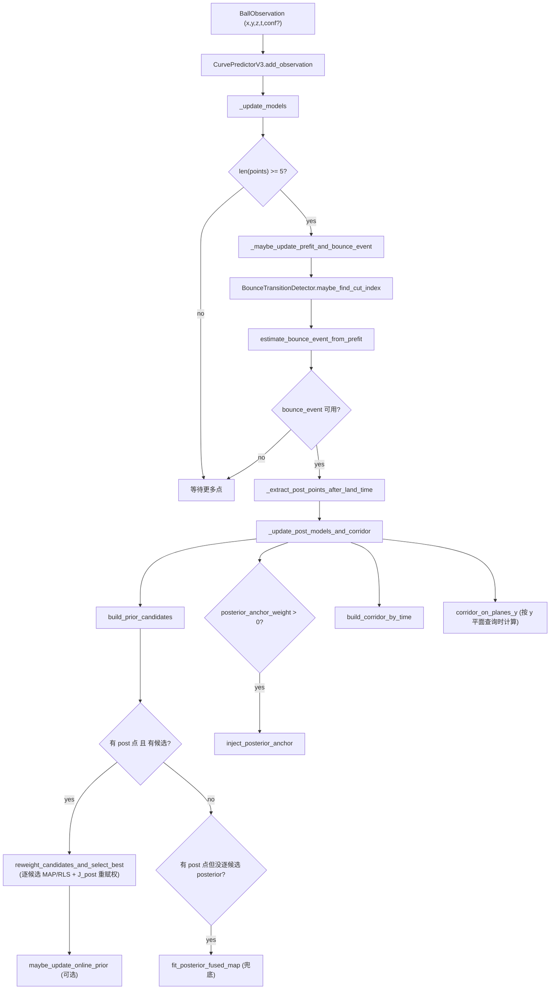

# curve_v3：反弹后第二段轨迹的两阶段预测器（prior + posterior）

`curve_v3` 是一个面向工程实时的网球反弹后第二段轨迹预测模块：

- **Stage 0 / prefit（反弹前）**：用反弹前滑窗点稳健估计反弹事件 $(t_b, p_b, v^-)$。
- **Stage 1 / prior（反弹后但尚无/少 post 点）**：由离散候选 $(e, k_t, \phi)$ 生成多条假设轨迹，并输出不确定性“走廊”（corridor）。
- **Stage 2 / posterior（反弹后有少量点，典型 $N\le 5$）**：对每个候选做小维 MAP/RLS 校正，按后验代价重赋权并选 best / 融合，更新走廊。

实现目标（更详细的算法背景见 `docs/02_curve.md`）：

- **稳定不炸**：时间基准 $t_b$ 尽量稳（避免 post 点污染导致漂移）。
- **few-shot 快收敛**：反弹后少点就能快速校正（小维线性系统，实时可控）。
- **低依赖**：主要依赖 NumPy + 标准库。

> 说明：反弹后飞行动力学主干默认只建模重力（解析传播）；未建模效应（弱气动/系统性偏差）主要通过 Stage 2 的等效项（如 $a_{xz}$）和候选走廊来吸收。

---

## 你可能最先想看的

- **最小使用方式**：看「快速开始」。
- **整体逻辑/数据流**：看「核心流程（从观测到走廊）」。
- **低 SNR（噪声填充导数）**：看 `docs/07_low_snr_policy.md` + 本文「低 SNR 退化策略」。
- **排障**：看本文「调试与单测」。

---

## 快速开始

### 新 API（推荐）

核心入口类：`curve_v3.core.CurvePredictorV3`（也可从包入口 `from curve_v3 import CurvePredictorV3` 导入）。

```python
from curve_v3 import CurvePredictorV3, CurveV3Config, BallObservation

cfg = CurveV3Config(
    # 常用：候选网格密度
    e_bins=(0.55, 0.70, 0.85),
    kt_bins=(0.45, 0.65, 0.85),
    # kt_angle_bins_rad=(0.0,)  # 默认关闭切向偏转，候选数=9
    # kt_angle_bins_rad=(-0.08, 0.0, 0.08)  # 打开偏转后候选数=27

    # 常用：走廊输出
    corridor_dt=0.05,
    corridor_horizon_s=1.2,
)

pred = CurvePredictorV3(config=cfg)

# 持续喂入观测（绝对时间戳 t，单位秒；坐标单位 m）
for (t, x, y, z, conf) in stream:
    pred.add_observation(BallObservation(x=x, y=y, z=z, t=t, conf=conf))

bounce = pred.get_bounce_event()            # BounceEvent | None
prefit = pred.get_pre_fit_coeffs()          # dict | None
cands = pred.get_prior_candidates()         # list[Candidate]
best = pred.get_best_candidate()            # Candidate | None
corr_t = pred.get_corridor_by_time()        # CorridorByTime | None
corr_plane = pred.corridor_on_plane_y(0.6)  # CorridorOnPlane | None

freeze = pred.get_prefit_freeze_info()      # PrefitFreezeInfo
low_snr = pred.get_low_snr_info()           # LowSnrInfo
```

几个容易踩坑的时间约定：

- `BallObservation.t` 是**绝对时间戳**。
- `CurvePredictorV3.time_base_abs` 会在第一帧观测时被设置。
- `BounceEvent.t_rel` 是**相对 time_base** 的时间（秒）。
- 反弹后模型内部常用 $\tau=t-t_b$（其中 $t_b$ 对应 `PosteriorState.t_b_rel` / `BounceEvent.t_rel`）。

### legacy API（已移除）

本仓库已移除旧版 `curve2.Curve` 的向下兼容适配层（`curve_v3.legacy` / `curve_v3.Curve` 不再提供）。
新代码请直接使用 `CurvePredictorV3`。

---

## 核心流程（从观测到走廊）

下面这张图对应 `src/curve_v3/core.py` 的真实编排（函数名与代码一致）：



这条链路里有 3 个“工程稳定性关键点”：

1) **prefit 冻结（分段契约）**：一旦认为进入反弹后段，就冻结 prefit，只用 pre 点估计 $t_b$，避免 post 点污染导致 $t_b$ 漂移。
2) **逐候选 posterior + 重赋权**：不是先选一个候选再拟合，而是“每个候选都先做 MAP 校正，再用后验代价更新权重”，降低少点时早锁错风险。
3) **走廊输出**：默认输出多峰更安全的分位数包络（可配），并支持按平面输出便于拦截逻辑。

---

## 关键数据结构（types.py）

类型定义集中在 `src/curve_v3/types.py`，核心对象如下：

- `BallObservation`：单帧观测（含可选 `conf`）。
- `BounceEvent`：反弹事件（`t_rel, x, z, v_minus`），可选带不确定度尺度（`sigma_t_rel` 等）。
- `Candidate`：prior 候选（`e, kt, kt_angle_rad, weight, v_plus, ax, az`）。
- `PosteriorState`：后验校正后的第二段状态（`v+axz` 参数化）。
- `CorridorByTime`：按时间输出的 $(x,z)$ 均值/协方差（可选分位数）。
- `CorridorOnPlane` / `CorridorComponent`：按平面 $y=const$ 的穿越统计（含可选 K=2 分量）。
- `PrefitFreezeInfo`：prefit 冻结诊断（`cut_index, freeze_t_rel, freeze_reason`）。
- `LowSnrInfo`：prefit/posterior 两阶段的低 SNR mode 标签。

---

## 代码结构速览（你要去哪儿改什么）

- `src/curve_v3/core.py`
  - **主编排器**：`CurvePredictorV3`。
  - 入口：`add_observation()`。
  - 主要 getter：`get_bounce_event()`、`get_prior_candidates()`、`get_best_candidate()`、`get_corridor_by_time()`、`corridor_on_plane_y()`、`get_prefit_freeze_info()`、`get_low_snr_info()`。

- `src/curve_v3/configs/models.py`
  - `CurveV3Config`：候选网格、RLS/MAP、走廊输出、prefit 鲁棒、分段检测器、低 SNR、online prior 等参数都在这里。

- `src/curve_v3/prior/`
  - `prefit.py`：`estimate_bounce_event_from_prefit()`，用反弹前点估计 $(t_b,p_b,v^-)$。
  - `candidates.py`：`build_prior_candidates()`，把 $(v^-, e, k_t, \phi)$ 映射为候选 $v^+$。
  - `models.py`：`PriorModel` 接口（可注入数据驱动先验权重）。
  - `online_prior.py` / `online_integration.py`：在线沉淀权重池（可选）。

- `src/curve_v3/posterior/`
  - `fit_posterior_fused_map()`：小维 MAP/RLS 求解。
  - `fusion.py`：`reweight_candidates_and_select_best()`（逐候选校正 + J_post 重赋权 + 选 best）。

- `src/curve_v3/corridor/`
  - `build_corridor_by_time()`：按时间输出走廊。
  - `corridor_on_planes_y()`：按平面输出穿越统计（含分位数/分量）。

- `src/curve_v3/low_snr/`
  - conf→权重（$w=1/\sigma^2$）与退化判别（FULL/FREEZE_A/STRONG_PRIOR_V/IGNORE_AXIS）。
  - 更详细说明：`docs/07_low_snr_policy.md`。

- `src/curve_v3/utils/bounce_detector.py`
  - `BounceTransitionDetector`：二态检测器（PRE→POST）+ gap-freeze，用于触发 prefit 冻结。

（已移除）`src/curve_v3/legacy/`：旧接口适配层。

---

## 常用配置速查（不必把 config.py 全背下来）

`CurveV3Config` 的字段很多，但日常调参一般绕不开下面这些“旋钮”：

- **触地/反弹高度（球心）**：`bounce_contact_y_m`
  - 默认 `None`，等价于 `ball_radius_m`（球半径）。
  - 如需对齐旧系统的约定，可由调用侧显式将其设为 `0.0`（本包不再内置兼容层）。

- **候选数（算力预算旋钮）**：
  - `e_bins`、`kt_bins`、`kt_angle_bins_rad`
  - 候选数 $M = |e\_bins|\cdot|kt\_bins|\cdot|kt\_angle\_bins\_rad|$。

- **post 点数量（工程建议）**：`max_post_points`
  - `docs/02_curve.md` 的推荐是第二阶段典型 $N\le 5$。
  - 本仓库默认设得比较大（999）避免离线评估“被意外截断”，线上建议由上层/调用侧做裁剪。

- **后验拟合参数化**：`fit_params`
  - `v_only`：只校正速度，最稳但吸收横向系统误差能力弱。
  - `v+axz`：额外估计 $a_{xz}$，更能吸收系统误差，但需要更保守的先验/低 SNR 策略兜底。

- **tb 联合搜索（增强项）**：`posterior_optimize_tb` + `posterior_tb_search_*`
  - 用于反弹附近缺帧时修复时间基准（详见 `docs/05_stage2_posterior.md` §7）。

- **走廊表达**：
  - `corridor_quantile_levels`：分位数包络（多峰更安全，默认 5/95）。
  - `corridor_components_k`：按平面输出的混合分量数（默认 2）。

- **低 SNR**：`low_snr_enabled` + `low_snr_sigma_*0_m` + `low_snr_delta_*`
  - 若你提供 `BallObservation.conf`，它会影响每点权重并参与退化判别。
  - 若你**不提供 conf**：权重会退化为常量；但退化判别仍可能基于 `sigma_*0_m` 和窗口统计触发（通常影响较小，但调得过激也可能“过度保守”）。

- **在线沉淀（可选）**：`online_prior_enabled` + `online_prior_*`
  - 开启后会将融合权重用 EMA 回灌到先验权重池（可选 JSON 落盘）。

### 注入数据驱动先验（PriorModel）

如果你有离线统计/样本生成的先验（方案3），可以把它作为 `prior_model` 注入：

```python
from curve_v3 import CurvePredictorV3, CurveV3Config
from curve_v3.prior import RbfSamplePriorModel

e_bins, kt_bins, prior = RbfSamplePriorModel.from_json("vl11_prior.json")

cfg = CurveV3Config(e_bins=e_bins, kt_bins=kt_bins)
pred = CurvePredictorV3(config=cfg, prior_model=prior)
```

注意：`prior_model` 输出的权重网格顺序与 `e_bins x kt_bins` 一一对应；因此通常让 config 的 bins 与先验文件保持一致。

---

## 排坑点（强烈建议看完）

这一节不是“怎么用”，而是专门总结 **最容易让结果变离谱** 的坑位，便于你在集成/调参/改算法时快速避坑。

### 1) 时间基准：abs / t_rel / $\tau$ 很容易混

- `BallObservation.t`：**绝对时间戳**。
- `CurvePredictorV3.time_base_abs`：第一帧观测的绝对时间戳。
- `BounceEvent.t_rel`：相对 `time_base_abs` 的时间（秒）。
- 反弹后内部模型常用 $\tau=t-t_b$：其中 $t_b$ 对应 `PosteriorState.t_b_rel`（同样是相对 time_base）。

典型症状：

- 你觉得拟合残差不算大，但 **落点时间/位置系统性漂**。

优先检查：

- `pred.get_prefit_freeze_info()` 是否在进入 post 后冻结（`is_frozen=True`）。
- `pred.get_bounce_event().t_rel` 是否随着 post 点增加而明显变化（正常情况下不应变化，除非你启用了 tb 联合搜索）。

### 2) 触地高度 y_contact：默认是“球半径”，旧系统常用 0

- 默认：`bounce_contact_y_m=None`，等价 `ball_radius_m`（球半径）。
- 若你需要对齐旧系统（把地面定义为 y=0 的“球心触地”口径），请由调用侧显式设置为 `0.0`。

典型症状：

- 同一段数据，用 legacy 和新 API 预测，触地时刻/落点 y 约定对不上。

建议：

- 如果你下游/数据集把地面定义为 y=0 的“球心触地”，就显式设置：`CurveV3Config(bounce_contact_y_m=0.0)`。
- 如果你想物理一致（球心触地高度=球半径），就用默认配置，并确保下游按这个口径解释。

### 3) prefit 冻结是“保命线”：别让 post 点回灌污染 $t_b$

`core.py` 的设计契约是：一旦检测进入反弹后段，就只用 pre 点估计反弹事件并冻结。

典型症状：

- post 点越多，$t_b$ 越往后漂；
- 于是 $\tau$ 被缩小/放大，后验为了自洽把 $v_y$ 或 $a_{xz}$ 拧到离谱。

排查入口：

- `tests/test_curve_v3_fusion.py` / `tests/test_curve_v3_bounce_detector.py`（冻结与 gap-freeze 行为都有覆盖）。

### 4) low SNR：不是“更准”，是“更不容易炸”

low SNR 的核心目标是防止“噪声填充导数”（慢轴尤其明显，例如 $v_x$ 很小）。

注意两点：

1) 如果你**提供了** `BallObservation.conf`，它会用于：
  - 构造每点权重（$w=1/\sigma^2$）；
  - 做窗口内退化判别（FULL/FREEZE_A/STRONG_PRIOR_V/IGNORE_AXIS）。
2) 如果你**不提供** conf：权重退化为常量，但退化判别仍可能基于 `sigma_*0_m` 等参数触发（通常影响不大，但阈值调得过激会过度保守）。

排查入口：

- `pred.get_low_snr_info()`：看 prefit/posterior 的 mode 标签。
- 详细策略说明：`docs/07_low_snr_policy.md`。

### 5) 权重逻辑的一个隐藏坑：别把 time-weight 和 conf-weight 级联相乘

`CurvePredictorV3.add_observation()` 里有一个刻意的实现约束：

- **时间递增权重**（越新越大）与 **conf 权重** 必须解耦。

如果你把“上一帧的总权重”拿来递推，会把 conf 重复乘入，造成权重级联爆炸（最终溢出为 `inf`），表现为：

- prefit/后验突然极端偏向最后几帧，输出变得非常不稳定。

### 6) `max_post_points` 默认很大：线上如果你只想 few-shot，请在调用侧裁剪

`docs/02_curve.md` 的工程建议是第二阶段典型 $N\le 5$。但配置默认值设为 999 是为了离线回放评估方便。

如果你线上严格按 few-shot 运行，建议：

- 在上层只喂入最近 5 个 post 点（或改小 `max_post_points`）。

### 7) corridor 输出的“None/invalid”约定

- `pred.corridor_on_plane_y(y)`：返回 `CorridorOnPlane | None`（若不可用直接 None）。
- `pred.corridor_on_planes_y([...])`：返回 list，每个元素都有 `is_valid` 标志；无效时会返回一个占位对象（便于批处理对齐）。

典型症状：

- 你以为“没穿越平面就是 bug”，其实可能是候选大部分没穿越（高度不够/时间窗不够/权重归一后有效比例太低）。

### 8) 候选数的算力预算：默认 kt_angle_bins_rad=(0,) 只给 9 候选

候选数：$M=|e\_bins|\cdot|kt\_bins|\cdot|kt\_angle\_bins\_rad|$。

- 默认 `kt_angle_bins_rad=(0.0,)`：关闭切向偏转，候选数 9。
- 若你打开 `(-0.08, 0.0, 0.08)`：候选数变 27，走廊通常更“覆盖”，但算力线性增加。

---

## 线上排障 checklist（从最常见到最致命）

当你遇到“突然炸掉/落点离谱/越更新越糟”时，建议按这个顺序排查：

1) **$t_b$ 是否漂移**
  - 看 `pred.get_bounce_event().t_rel`，以及 `pred.get_prefit_freeze_info()`。
  - 若漂移：优先怀疑分段/冻结没触发或被绕开。

2) **low SNR 是否在关键轴触发了退化**
  - 看 `pred.get_low_snr_info()`：例如 x 轴进入 `IGNORE_AXIS`/`STRONG_PRIOR_V` 是“保守保护”，不一定是坏事。

3) **best 候选是否“解释得通 post 点”**
  - 对照 `tests/test_curve_v3_fusion.py` 的行为：best 应与 $\arg\min J_{post}$ 对齐。

4) **走廊是否多峰/被单均值误导**
  - 优先用分位数包络（`corridor_quantile_levels`）或按平面的 components（`corridor_components_k`）做可视化/决策。

5) **如果反弹附近缺帧明显：考虑开启 tb 联合搜索**
  - `CurveV3Config(posterior_optimize_tb=True, ...)`（详见 `docs/05_stage2_posterior.md` §7）。

建议你在回放/日志里至少记录这些字段（都是稳定接口，不需要访问私有成员）：

- `PrefitFreezeInfo`（冻结原因、时间、cut_index）
- `BounceEvent.t_rel`、`BounceEvent.v_minus`
- 候选数量与 `best` 的 (e,kt,phi/kt_angle) 与权重
- `LowSnrInfo`
- `corridor_on_plane_y(...).valid_ratio/crossing_prob/is_valid`

---

## 关键机制（为什么这么设计）

### 1) prefit 冻结：保护时间基准 $t_b$

真实数据里反弹附近经常缺帧/遮挡。如果把反弹后点混入 prefit，常见后果是：

- 触地求根被推迟（$t_b$ 变大）
- 第二段相对时间 $\tau=t-t_b$ 被系统性拉偏
- 后验阶段为了解释这些偏差会“硬拧”速度/加速度，导致落点/拦截点灾难性漂移

因此 `core.py` 使用 `BounceTransitionDetector` 来决定 `cut_index`，并通过 `PrefitFreezeInfo` 对外输出“何时、因何冻结”，便于回放复现。

### 2) 低 SNR 退化：防止“噪声填充导数”

当某一轴真实运动很慢（例如 $v_x$ 很小）时，噪声会被拟合成速度/加速度（看起来残差不大，但导数发散）。

本仓库的策略是：

- 若提供 `BallObservation.conf`：用 conf 构造每点权重（并在必要时触发退化）。
- 用窗口内“可辨识性启发式”判定每轴的 mode：
  - `FULL` / `FREEZE_A` / `STRONG_PRIOR_V` / `IGNORE_AXIS`

> 小提醒：`low_snr_enabled=True` 时即使不提供 conf，也可能触发退化判别（由 `sigma_*0_m` 等参数决定）。如果你希望完全不改变旧行为，最保守的做法是显式关闭 `low_snr_enabled`。

对应实现位置：`src/curve_v3/low_snr/`，说明文档：`docs/07_low_snr_policy.md`。

### 3) 候选融合：逐候选 MAP 校正 + log-sum-exp 重赋权

`reweight_candidates_and_select_best()` 的核心行为是：

1. 对每个候选先做一次小维 MAP/RLS 校正（得到该候选“最能解释数据”的后验状态）。
2. 计算后验代价 $J_{post}$。
3. 用数值稳定的 log-sum-exp 更新权重，并选择 best。

这比“先按先验权重选分支再拟合”更抗 $N\le 2$ 的噪声（减少早锁错）。

### 4) posterior anchor（可选）：让走廊更贴近期望输出

如果 `posterior_anchor_weight > 0`，会将 posterior 解作为一个“合成候选”注入走廊混合中，提升短期走廊的一致性（实现：`inject_posterior_anchor()`）。

### 5) online prior（可选）：把后验经验回灌到先验

如果 `online_prior_enabled=True`，系统会将融合后的候选权重用 EMA 沉淀到权重池中（可选落盘），用于下一回合的先验权重（`docs/09_data_driven_prior.md` §5 有更完整讨论）。

---

## 输出：corridor_by_time vs corridor_on_plane_y

### corridor_by_time（按时间）

- `pred.get_corridor_by_time()` 返回 `CorridorByTime`。
- 输出的是每个采样时刻 $t_k$ 上的 $(x,z)$ 统计（均值/协方差 + 可选分位数）。
- 适合：需要连续时间序列或要画图可视化的场景。

### corridor_on_plane_y（按平面，推荐用于拦截）

- `pred.corridor_on_plane_y(target_y)` 返回 `CorridorOnPlane | None`。
- 含 $(x,z)$ 的统计、到达时间统计、有效候选比例等。
- 适合：下游以“球穿过某个高度平面”作为拦截事件的决策逻辑。

> 默认选择反弹后 **下降穿越**（即 $\tau>0$ 且 $\dot y(\tau)<0$）。

---

## 调试与单测（行为契约在哪里）

如果你在改逻辑/调参，建议优先对齐单测里的“契约行为”。与 `curve_v3` 强相关的测试包括：

- `tests/test_curve_v3_fusion.py`
  - best candidate 与 $\arg\min J_{post}$ 的一致性
  - prefit 在进入 post 后应冻结
  - posterior anchor 对走廊的影响

- `tests/test_curve_v3_bounce_detector.py`
  - vy 翻转触发、near-ground 条件、gap-freeze 等

- `tests/test_curve_v3_low_snr.py`
  - IGNORE_AXIS / STRONG_PRIOR_V 等退化行为

- `tests/test_curve_v3_rls_and_config.py`
  - RLS($\lambda=1$) 与批量正规方程的一致性
  - e_range clamp 等配置行为

### 合成带噪数据测试（推荐作为回归 smoke test）

本包提供了一个轻量的合成数据生成工具：

- `src/curve_v3/offline/testing/synthetic.py`
  - `make_prebounce_observations_ballistic(...)`：生成反弹前抛体观测（可叠加高斯噪声）。
  - `make_postbounce_observations_from_candidate(...)`：用候选动力学生成反弹后观测（可叠加高斯噪声）。

对应的回归测试：

- `tests/test_curve_v3_synthetic_noisy.py`
  - 目标是覆盖“带噪输入能稳定跑通主链路、关键输出不出现 NaN/inf”。

运行方式：

- 在 `packages/curve_v3` 目录下执行：`uv run python -m pytest`

---

## 进一步阅读

- 算法/工程报告（更完整）：`docs/02_curve.md`
- 低 SNR 策略速查：`docs/07_low_snr_policy.md`
- 观测噪声与权重口径：`docs/06_observation_noise_and_weights.md`

